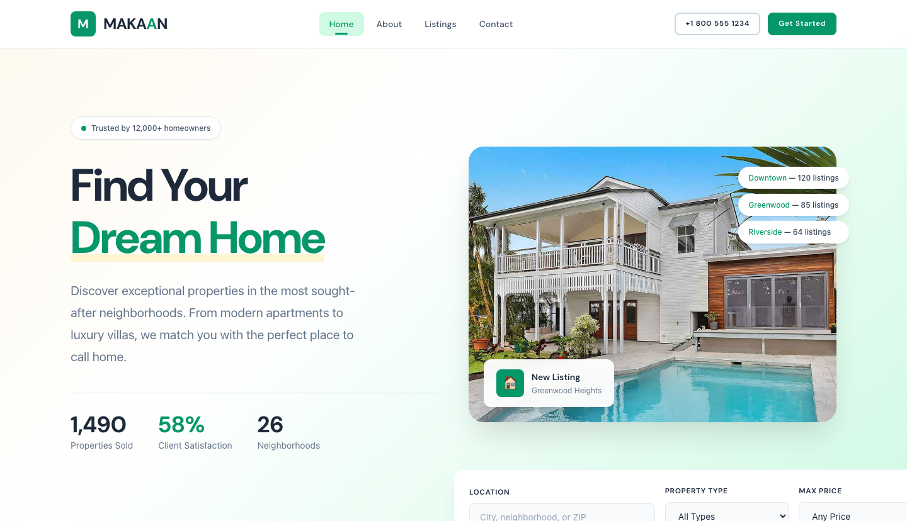

# MAKAAN — Real Estate HTML Template

A premium, framework-free real estate website template built with semantic HTML, modern CSS, and vanilla JavaScript. Designed for property companies, real estate agencies, and luxury home listings.

**Brand:** MAKAAN — "Find Your Dream Home."

---

## Pages

| Page | File | Description |
|------|------|-------------|
| Home | [index.html](index.html) | Hero with property search form, featured listings grid, about preview, testimonials, CTA |
| About | [about.html](about.html) | Company story, core values, team members |
| Listings | [listings.html](listings.html) | Filterable property grid with category tabs, 6 property cards with price/bedrooms/area |
| Contact | [contact.html](contact.html) | Inquiry form with validation, agent info cards, office locations |

---

## Tech Stack

- **HTML5** — Semantic, accessible markup
- **CSS3** — Custom properties, Grid, Flexbox, animations, no frameworks
- **Vanilla JavaScript** — IntersectionObserver, form handling, burger toggle, filter tabs
- **Google Fonts** — DM Sans (headings) + Inter (body)

## 📸 Screenshot



## Design System

| Token | Value |
|-------|-------|
| Primary | Emerald `#059669` |
| Secondary | Navy `#1E293B` |
| Accent | Cream `#FEF3C7` |
| Font (headings) | DM Sans |
| Font (body) | Inter |
| Breakpoints | 980px, 720px |
| Border radius | 4px - 24px scale |

## Features

- Fully responsive (desktop, tablet, mobile)
- Sticky header with scroll effect
- Mobile burger navigation with animated transitions
- Property search form (location, type, price)
- Filterable listings with category tabs
- Property cards with favorite toggle, badges, and hover effects
- Counter animation for stats
- Scroll-triggered reveal animations
- Form validation with success/error feedback
- Back-to-top button
- Newsletter subscription form
- `prefers-reduced-motion` support

## Getting Started

1. Download or clone this folder
2. Open `index.html` in any modern browser
3. No build step, no dependencies — everything runs standalone

## Customization

All design tokens are defined as CSS custom properties in `assets/css/style.css` under `:root`. Override them to rebrand:

```css
:root {
  --clr-emerald: #059669;   /* Change primary color */
  --clr-navy: #1E293B;      /* Change secondary color */
  --clr-cream: #FEF3C7;     /* Change accent color */
  --font-heading: 'DM Sans', sans-serif;
  --font-body: 'Inter', sans-serif;
}
```

Replace images in `assets/img/` with your own property photos, team headshots, and testimonials.

## SEO Keywords

real estate, property listings, homes for sale, luxury real estate, property search, dream home, real estate agent, house hunting, buy home, sell home, property investment, residential real estate

---

Let's Build Something Together
https://tally.so/r/q4q1L9
